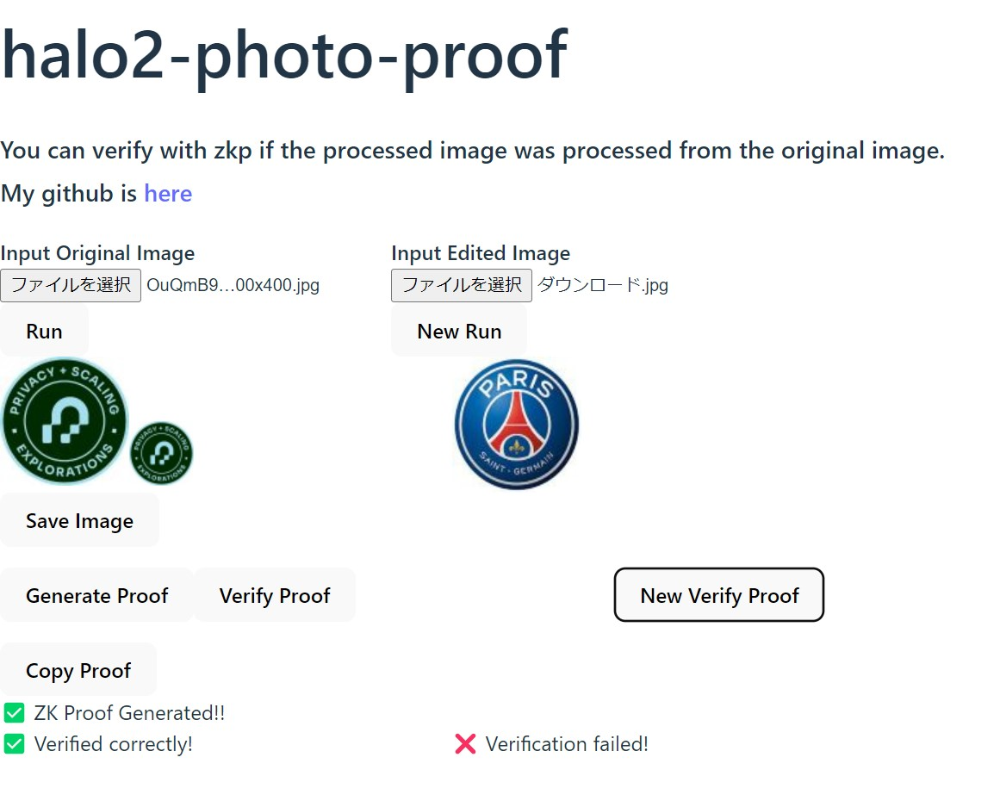
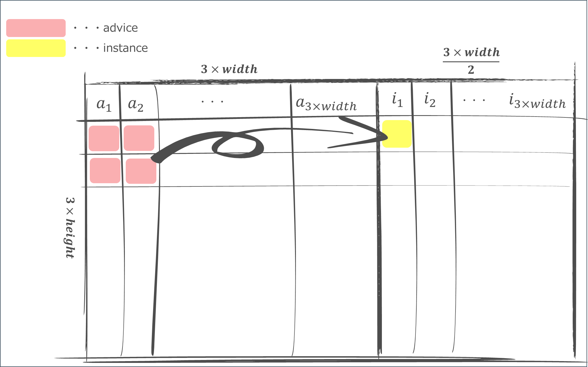
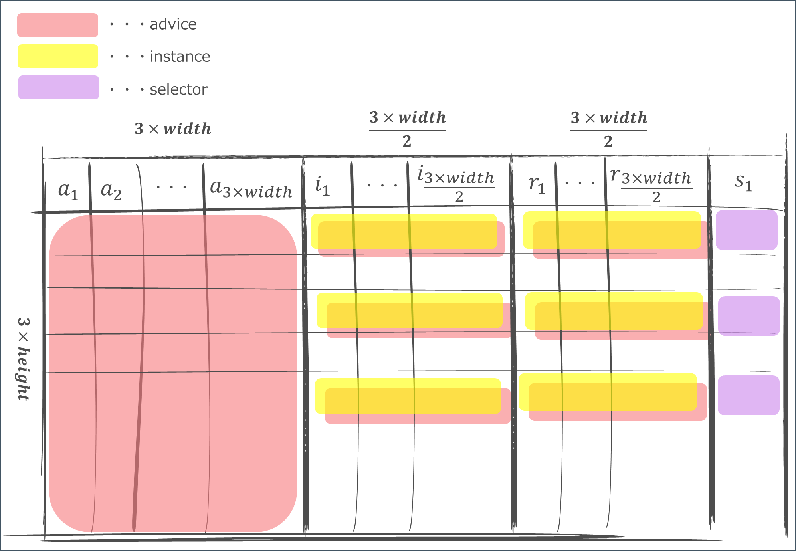

# halo2-photo-proof

You can verify with zkp if the processed image was processed from the original image.  

  

***DEMO:***
[Demo cite is here](https://silly-chimera-4a709a.netlify.app/)

This project is part of the [PSE ZK Summer Contribution Program](https://pse-team.notion.site/PSE-ZK-Summer-Contribution-Program-fffef810476a45e88394fd120dc48697), so big thanks to aaa for teaching us about halo2 implementation, wasm, and related libraries.
# Motivation

Many photos in newspapers and other media are taken with digital cameras. When a photo taken with a digital camera appears in a newspaper or online news, it is impossible to verify when, where and how it was taken  
(of course there will be a description of the photo, but can you trust it? It would be even better if it could be verified).  

Now that you have image data signed by a private key embedded in the camera, you can prove the data is authentic and trustworthy. However, when the image is published in an online newspaper, it is processed (resized, cropped, rotated, etc.). 

At this point, the signature no longer works and a new, third-party signature is required to prove that the signed image has been processed.   
For example, image processing software could perform the signature.   
This library could prove that the processed images were processed from the original images. In other words, without re-signing the processed image data, it is possible to prove that the image was processed from the signed photograph.

# How to use

> **Warning**
> 1. On my laptop it took about 100 to 150 seconds to generate a proof for a $100 X 60$ image. Smaller image sizes are better.    
> 2. If you use Chrome, please do not open the devtool while generating the proof. Opening it will slow down the proofing process.

1. select the image you want to prove and upload it using the `Run` button   
(You can also save the processed image with the `Save Image` button)
1. Press the `Generate Proof` button to generate the proof.   
(It is also possible to copy the byte data of the zkp proof with `Copy Proof`)
1. Verify the zkp proof using the `Verify Proof` button.

You can also run a proof with incorrect images by following the steps below.

1. in `Input Edited Image` on the right, select a processed (reduced) image different from the one used to generate the proof, and upload it by clicking the `New Run` button. 
2. Verify the zkp proof using the `New Verify Proof` button.  

You can also confirm that the verification was successful by saving the processed image generated on the left with `Save Image`, selecting it with `Input Edited Image` on the right, uploading it with the `New Run` button, and verifying it with the `New Verify Proof` button.
# Circuit

The image processing implemented this time is to reduce the image size to a quarter of the original size. Due to the loss of information caused by the reduction in image size, the original image cannot be generated from the processed image.  
However, using zero-knowledge proofs, it is possible to prove that the processed image was generated from the original image without knowing the original image.     

[Halo2](https://github.com/zcash/halo2) is essentially a circuit with row-column operations.    
There are four main types of columns, which are briefly described below.    
For more information, see the [book here](https://zcash.github.io/halo2/index.html).
- Advice columns: private input, needed to calculate witness in zkp
- Instance columns: public input, needed to verify proofs
- Selector columns: These are binary values, and can be used to select the calculation required for the constraint.
- Fixed columns: Stores fixed values needed during calculations

The image consists of three RGB values for each pixel (the implementation also deals with $\alpha$, which represents transparency, but we didn't consider $\alpha$ in the following description). A table cell must be assigned to each RGB value of each pixel. 

Reduction means taking the average of the RGB values of each pixel of the $2 \times 2$.
In other words, if the image size before processing is width * height, the image size after processing is $\frac{width}{2} \times \frac{height}{2}$.  
The image before processing is assigned to the Advice column, and the image after processing is assigned to the Advice and Instance columns.

The constraint is that the RGB value of each pixel in the processed image should be the average of the RGB values of each pixel in the unprocessed image.  
As shown in the figure below, we can divide the sum of each pixel in $2 \times 2$ by $4$ to ensure that it matches the pixel in the reduced image in the Instance column.

  

However, it is important to note that all the operations in the ZKP circuit performed on finite numbers, so it is impossible to perform the ordinary integer incremental arithmetic that we imagine.    

For example, $3 \div 4 = 0$ remainder $3$ for ordinary integer arithmetic, but $3 \div 4 = 2 \bmod 5$ on a finite field, and the expected solution cannot be obtained if there is a remainder. 

We can, therefore, ensure that the image is correctly compressed by adding a new column of remainders to the advice column and the instance column, and applying a constraint so that $a == c*b +d$ for the relation $a / b = c$ remainder $d$.  
(Also, a range check that $0 \leq d \le b$ is needed as a constraint, but this has not yet been implemented).  

Below is a diagram of the entire table.

  

# TODO

 - [ ] range check implementation
 - [ ] Optimize circuitry and reduce execution time
 - [ ] Implement parallel processing using Web Worker, etc.
 - [ ] Implement other processing such as image rotation, cropping, etc.